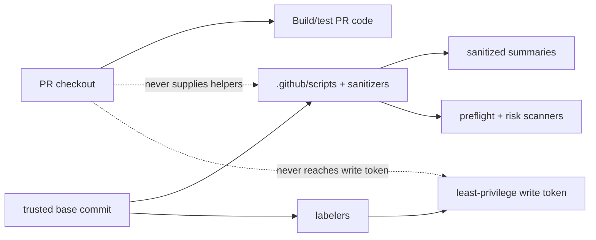

# Workflow Security Trust Boundaries

Maintainer quick reference for workflow, script, sanitizer, cache, artifact,
release, labeler, or PR automation changes.

## Visual Model



## Rules

| Area | Rule |
|------|------|
| PR code | Build/test with read-only credentials and `persist-credentials: false`. |
| Helpers | Source `.github/scripts` and sanitizers from `${{ github.event.pull_request.base.sha || github.sha }}`, not the PR checkout. |
| Privileged automation | `pull_request_target`, releases, package pruning, and labelers must not execute PR-head content before mutation. |
| Fork PRs | `ci-pr-action` and `ci-json-roundtrip` run only for same-repository heads. `ci-matlab` is intentionally manual-dispatch only, so it has no fork-PR execution path. Fork automation and agent-policy changes are handled by the trusted-base `Fork Automation Gate`. |
| Exceptions | Mark reviewed exceptions with `preflight: allow-* reason=<short-reason>` so maintainers see them in logs and summaries. |

## Fork Automation Boundary

`ci-fork-automation-gate.yml` runs on `pull_request_target`, checks out only
the base commit's sanitizer helpers, and obtains changed file names through the
GitHub API. It never checks out, sources, or executes fork content.

For a fork PR, changes to workflows, repository scripts, actions, hooks,
Docker files, root `docker/`, `iccdev-mcp/docker/`, CMake/build configuration,
any `CMakeLists.txt` or `.cmake` file, root `scripts/`, or agent-policy surfaces
fail the gate and receive the existing `Governance` label. Agent-policy surfaces
are `.github/copilot-instructions.md`, `.github/instructions/**`,
`.github/skills/**`, `.github/prompts/**`, `.github/agents/**`, `.agents/**`,
and every `AGENTS.md`, `CLAUDE.md`, or `GEMINI.md`. The guarded PR jobs above
do not execute fork code. `ci-matlab` intentionally has no `pull_request`
trigger, so its Windows MATLAB job is excluded from the fork-PR guard finding.
Renames are checked at both paths, and PRs beyond GitHub's 3,000-file
enumeration limit fail closed.

Treat instruction and skill content from fork PR heads as untrusted review
guidance. The gate protects protected-path changes but does not make external
review systems load the trusted base.

Repository Actions settings must keep the approval policy at **all external
contributors**. Do not approve a fork workflow run after the `Governance`
label is applied; the label requires maintainer review of the protected-path
change.

## Clean Preflight Expectations

Enumerate the current workflow surface instead of recording a branch-local
count:

```bash
find .github/workflows -maxdepth 1 -type f \( -name '*.yml' -o -name '*.yaml' \) \
  -printf '%P\n' | LC_ALL=C sort
```

A clean preflight reports no cache, artifact, authentication, PR-script, token,
or CodeQL canaries, and no failures.

Reviewed exceptions should appear as:

```text
[OK] ... reviewed ... exception reason=<short-reason>
```

Rerun the enumeration after adding or removing files under `.github/workflows/`.

## Commands

```bash
PREFLIGHT_BASE_REF=origin/master .github/scripts/preflight-safety-checks.sh --require-tools
gh workflow run ci-preflight-safety.yml --ref <branch>
gh workflow run ci-pr-risk-security-analysis.yml --ref <branch> \
  -f analysis_target='Current branch workflows'
```
